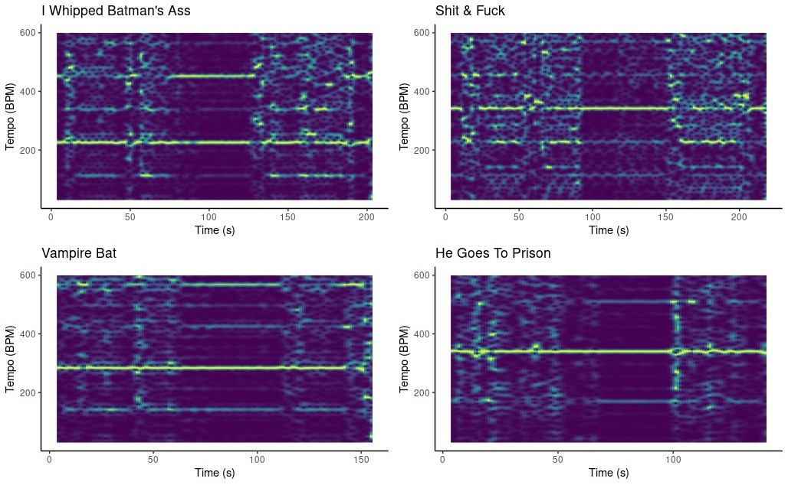

```{r setup, include=FALSE}
# Load packages
library(tidyverse)
library(tidymodels)
library(plotly) 
library(spotifyr)
library(ggrepel)
library(flexdashboard)
library(compmus)
library(ggplot2)
library(ggdendro)
library(heatmaply)


# Load entire discography 
snowden_disc <- get_artist_audio_features("12XwWwI5wcnQySACjbgf2y")
eilert_disc <- get_artist_audio_features("7aS6aXw9eYfVQxCG1RcVEK")
willis_disc <- get_artist_audio_features("50yovZJnAHoy0pBruvFaCR")
tim_disc <- get_artist_audio_features("0Nc79lkTxXLSIIHDB8mqJC")
shaggs_disc <- get_artist_audio_features("5ixdD9E7P9r51AOcSInQbl")
daniel_disc <- get_artist_audio_features("1jeYbk5eqo6wgsQPjLeU5w")

# Create new dataframe with all artists entire discography
disc <- list(snowden_disc, eilert_disc, willis_disc, tim_disc, shaggs_disc, daniel_disc) %>%
  reduce(full_join)


# Load specific albums
snowden_album <- subset(snowden_disc, album_name=="Life in the USA and Canada")
eilert_album <- subset(eilert_disc, album_name=="Eilert Is Back")
willis_album <- subset(willis_disc, album_name=="Rush Hour")
tim_album <- subset(tim_disc, album_name=="God Bless Tiny Tim")
shaggs_album <- subset(shaggs_disc, album_name=="Philosophy of the World" & album_id=="0TzI1YcMAQVdQ4yUZuy7fA")
daniel_album <- subset(daniel_disc, album_name=="Yip / Jump Music")

# Create new dataframe with all albums
albums <- list(snowden_album, eilert_album, willis_album, tim_album, shaggs_album, daniel_album) %>%
  reduce(full_join)

```


### Outsider Mucisans: **idiosyncratic** and **unconnected** from conventional art **by circumstance**.

Outsider music is a derivative of <a href="https://www.britannica.com/art/outsider-art">outsider art</a>, which is defined as "any work of art produced by an untrained idiosyncratic artist who is typically unconnected to the conventional art world—not by choice but by circumstance." Its defining feature is "the tendency of the artists to be “straight talking” (even if that talk is straight from a radically different worldview)." In 2000, Irwin Chusid conceptualized the term outsider music in his book: _Songs in the Key of Z_, in which he explores the field of outsider music by highlighting its most prominent artists. Chusid defines outsider music as "crackpot and visionary music, where all trails lead essentially one place: over the edge." The book was accompanied by two compilation albums that featured a variety of outsider musicians. 

These definitions are quite vague, however, I think that we can make it less ambiguous if we look at the differences between outsider musicians and other idiosyncratic musicians that make unconventional music. The first difference is that outsider musicians create unconventional art by circumstance, and not by choice. "By circumstance" can be interpreted in multiple ways. One interpretation is easily noticeable from Chusid's categorization, and that is that most of the artists have some kind of mental disorder. Tiny Tim had asperger's syndrome, Wesley Willis was a schizophrenic, and Daniel Johnson was both schizophrenic and bipolar. In other words, their unconventionality stemmed from their disorders. Another interpretation is exemplified by The Shaggs, they were a band comprised of three teenage sisters formed by their father in 1968. Their story goes as follows, one day their father received news from his fortune teller mother that his daughters would become famous musicians, even though his daughters didn't have any experience in making music. After hearing this prophecy he withdrew his daughters from school and sold some family belongings to purchase his daughters' instruments, and so the band was formed. These "regular" children essentially had no choice than to play music, and their inexperience shines trough on their first album _Philosophy of the World_. Despite the quality of their music, the Shaggs were praised by fellow musicians, Frank Zappa called them "better than The Beatles" and Kurt Cobain listed _Philosophy of the World_ as his fifth favorite LP of all time.

Another key difference that sets outsider musicians apart is the amateurish sound of their music. If the definition of an outsider musician is a musician that makes unconventional music by circumstance, then we would have to consider Beach Boys' Brian Wilson as an outsider musician as well, as he was, like Daniel Johnson, diagnosed with schizophrenia and bipolar disorder. However, Wilson's music is far more commercially successful than all of the outsider musicians mentioned by Chusid, I think that this is due to the fact that his music doesn't poses an amateurish quality. In summary, his means that the two defining features of outsider music are that it sounds amateuristic, and that it sounds unconventional because of the circumstances the musicians find themselves in. 

My goal is to determine whether it is possible to categorize these outsider musicians on the basis of their computational musical features. This will be done by analyzing the corpus with the track-based features provided by Spotify, alongside popular Music Information Retrieval (MIR) techniques. My corpus will consist of six albums created by artists that can be found on the compilation albums of Chusid's Songs in the Key of Z. The artists that will be analyzed can be seen below, and the corpus is listed in the panel on the right.


{width=20%}
{width=20%}
{width=20%}

(From left-to-right: B.J. Snowden, Eilert Pilarm, Wesley Willis)

{width=20%}
{width=20%}
{width=20%}

(From left-to-right: Tiny Tim, The Shaggs, Daniel Johnson)


***
{width=100%} 

**Corpus:**

 - _Life In the USA and Canada_, by B.J. Snowden
 - _Eilert Is Back_, by Eilert Pilarm
 - _Rush Hour_, Wesley Willis
 - _God Bless Tiny Tim_, by Tiny Tim
 - _Philosophy of the World_, by The Shaggs
 - _Yip/Jump Music_, by Daniel Johnston
 
_Note_: these albums were chosen in particular because they are the most popular album of each artist. 
 
**Strengths and limitations of the corpus:**
_Strengths:_

 - The artists all have a very unique style of making music.
 - All of the albums have been classified as outsider music, without much debate. Except for that one time that B.J. Snowden criticized Chusid because she felt she did not belong on his list of outsiders.
 - Variety in styles might point to some interesting differences between these outsider musicians.
 
_Limitations:_

 - There are much more outsider musicians that are not in my corpus.
 - All of Wesley Willis' songs have the exact same structure, perhaps this could be valuable, who knows. 
 - Eilert Pilarm is a Swedish Elvis impersonator, thus his album is entirely comprised of Elvis covers.
 - The fact that the artists all have a very unique style of making music could make generalizing outsiders difficult. 


### Outsiders **cannot be generalized** trough mood.


```{r eval=FALSE, include=FALSE}
mean_valence_energy <- albums %>% 
  group_by(album_name) %>% 
  summarise(artist_name = artist_name,
            album_name = album_name,
            track_name = track_name,
            valence = mean(valence),
            energy  = mean(energy))


song_mood_plot <- ggplot(albums, aes(energy, valence, color=artist_name, shape=artist_name, label=track_name)) +
  geom_point(alpha=.45) +
  geom_point(data=mean_valence_energy, size=4) +
  geom_vline(xintercept=0.5, linetype="dotted") +
  geom_hline(yintercept=0.5, linetype="dotted") +
  theme_bw() +
  xlim(0,1) +
  ylim(0,1) +
  labs(
    title = "Song mood (corpus albums)",
    x = "Energy",
    y = "Valence",
    color = "Artist",
    shape = "Artist"
  )

song_mood_plot <- song_mood_plot + 
                 annotate("text", x=.25, y=.25, label="Sad", alpha=.6) +
                 annotate("text", x=.25, y=.75, label="Relaxed", alpha=.6) +
                 annotate("text", x=.75, y=.25, label="Angry", alpha=.6) +
                 annotate("text", x=.75, y=.75, label="Happy", alpha=.6) 
```


```{r eval=FALSE, include=FALSE}
mean_valence_energy_disc <- disc %>% 
  group_by(artist_name) %>% 
  summarise(artist_name = artist_name,
            album_name = album_name,
            track_name = track_name,
            valence = mean(valence),
            energy  = mean(energy))

song_mood_plot_disc <- ggplot(disc, aes(energy, valence, color=artist_name, shape=artist_name, label=track_name)) +
  geom_point(alpha=.25) +
  geom_point(data=mean_valence_energy_disc, size=4) +
  geom_vline(xintercept=0.5, linetype="dotted") +
  geom_hline(yintercept=0.5, linetype="dotted") +
  theme_bw() +
  xlim(0,1) +
  ylim(0,1) +
  labs(
    title = "Song mood (entire discogrophy)",
    x = "Energy",
    y = "Valence",
    color = "Artist",
    shape = "Artist"
  )

song_mood_plot_disc <- song_mood_plot_disc + 
                 annotate("text", x=.25, y=.25, label="Sad", alpha=.6) +
                 annotate("text", x=.25, y=.75, label="Relaxed", alpha=.6) +
                 annotate("text", x=.75, y=.25, label="Angry", alpha=.6) +
                 annotate("text", x=.75, y=.75, label="Happy", alpha=.6) 

```
{width=100%}


***

To examine if outsiders can be categorized by mood, I plotted the mean valence and energy of each album to determine the albums mood (relaxed, happy, angry or sad). Spotify defines these parameters as follows:

- Valence: A measure from 0.0 to 1.0 describing the musical positiveness conveyed by a track. Tracks with high valence sound more positive (e.g. happy, cheerful, euphoric), while tracks with low valence sound more negative (e.g. sad, depressed, angry).

- Energy: Energy is a measure from 0.0 to 1.0 and represents a perceptual measure of intensity and activity. Typically, energetic tracks feel fast, loud, and noisy. For example, death metal has high energy, while a Bach prelude scores low on the scale. Perceptual features contributing to this attribute include dynamic range, perceived loudness, timbre, onset rate, and general entropy.

***

When we look at these results, we can see that all albums are relatively close to the center of the plot. This means that we cannot confidently match any album to a certain mood. We can only conclude that Tiny Tim's album is less energetic than all of the other albums, and that Wesley Willis' album is more energetic than the other albums. Another interesting finding is that all of the albums are not overly positive or negative, all of the albums have a similar valence centered around 0.5.

However, the main take-away is that **we cannot generalize these outsider musicians trough the mood of their music.**

In the plot on the right we can interestingly see that, for all of the artists, the mood of their albums (in the corpus) are consistent throughout their entire discographies. Thus the corpus is an accurate representation of the artists' entire music catalog. Another assumption we can make based on this outcome is, that **the artists did not experiment a lot when it comes to valence and energy throughout their careers.**


### Outsiders all **sound different**.

```{r cohesivenessplot, echo=FALSE, message=FALSE, warning=FALSE}
danceability_valence_energy_albums <- albums %>% 
  group_by(artist_name) %>% 
  summarise(artist_name = artist_name,
            album_name = album_name,
            track_name = track_name,
            score = valence + energy + danceability)

mean_std <- danceability_valence_energy_albums %>%
  group_by(album_name) %>%
  summarise(m = mean(score),
            s = sd(score)
  )

cohesivenessplot <- ggplot(danceability_valence_energy_albums, aes(x=album_name, y=score, color=artist_name, label=track_name)) + 
    geom_violin(alpha=.4) +
    geom_jitter(position=position_jitter(0.15), alpha=0.4) +
    #geom_boxplot(alpha=.2, width=.2) +
    ylim(0,3) +
    labs(title = "Album cohesiveness", x="Album name", y="Cohesiveness Score", color="Artist") +
    theme(axis.text.x = element_text(angle=40, hjust=1))

ggplotly(cohesivenessplot)
```

***

To delve deeper into the sound of each album, I introduce a coheisiveness score (comprised of descriptive scores rather than confidence scores) to determine the overall sound of each album, this score is defined as follows:

- cohesiveness score = danceability + valence + energy

- Where dancability is defined by Spotify as: Danceability describes how suitable a track is for dancing based on a combination of musical elements including tempo, rhythm stability, beat strength, and overall regularity. A value of 0.0 is least danceable and 1.0 is most danceable.

***

From these results we can observe a couple of findings. First, we can see that **Wesley Willis's album is the most cohesive, meaning that all of his songs sound similar.** This is no surprise when we take into account that all of his songs have the exact same song structure, alongside the fact that all of his basically sound the same, a topic that will be further explored in a latter section. 

Another finding is that **_Eilert Is Back_, _Godbless Tiny Tim_ and _Yip/Jump Music_ all have a high variance in cohesiveness score, meaning that they have a wide variety in songs** (in the case of Eilert Pilarm's album this is not so strange, as it is essentially an Elvis compilation album). This is contrasted by Life In the USA and Canada and Philosophy of the World, which are albums that consist of songs that are more similar to eachother.


### Some tracks aren't regular. (pt. 1)

```{r spokenwordsplot, echo=FALSE, message=FALSE, warning=FALSE}
spokenwordplot <- ggplot(albums, aes(x=album_name, y=speechiness, color=artist_name, label=track_name)) +
  geom_jitter(width=.3) +
  geom_text(aes(label=ifelse(speechiness>.66,as.character(track_name),'')),size=3) +
  geom_hline(yintercept=0.66, linetype="dotted", alpha=.6) +
  ylim(0,1) +
  labs(title = "Spoken word songs", x="Album name", y="Speechiness", color="Artist") +
  theme(axis.text.x = element_text(angle=40, hjust=1))

ggplotly(spokenwordplot)

```

***

To examine the corpus is more detail, I wanted to determine what songs are outliers. When we look at the Spotify feature: speechiness, which is defines as:

- Speechiness: detects the presence of spoken words in a track. The more exclusively speech-like the recording (e.g. talk show, audio book, poetry), the closer to 1.0 the attribute value. Values above 0.66 describe tracks that are probably made entirely of spoken words. Values between 0.33 and 0.66 describe tracks that may contain both music and speech, either in sections or layered, including such cases as rap music. Values below 0.33 most likely represent music and other non-speech-like tracks.

***

We can see that only **three songs in the entire corpus are spoken word songs** according to Spotify. Eilert Pilarm, B.J. Snowden, The Shaggs, and Wesley Willis all refrained from making spoken word tracks.

### Some tracks aren't regular. (pt. 2)

```{r instrumentalplot, echo=FALSE, message=FALSE, warning=FALSE}
instrumentalplot <- ggplot(albums, aes(x=album_name, y=instrumentalness, color=artist_name, label=track_name)) +
  geom_jitter(width=.3) +
#  geom_text_repel(data=filter(albums, instrumentalness>0.5), aes(label=track_name), size=3) +
  geom_hline(yintercept=0.5, linetype="dotted", alpha=.6) +
  geom_text(aes(label=ifelse(instrumentalness>.5,as.character(track_name),'')),size=3,hjust=1,vjust=-.5) +
  ylim(0,1) +
  labs(title = "Instrumental songs", x="Album name", y="Instrumentalness", color="Artist") +
  theme(axis.text.x = element_text(angle=40, hjust=1))

ggplotly(instrumentalplot)
```

***

When it comes to instrumentalness, which Spotify defines as:

- Instrumentalness: predicts whether a track contains no vocals. “Ooh” and “aah” sounds are treated as instrumental in this context. Rap or spoken word tracks are clearly “vocal”. The closer the instrumentalness value is to 1.0, the greater likelihood the track contains no vocal content. Values above 0.5 are intended to represent instrumental tracks, but confidence is higher as the value approaches 1.0.

***

We can see that **six songs in the entire corpus are instrumental songs** according to Spotify. In this case, Eilert Pilarm, The Shaggs, and Wesley Willis all refrained from making instrumental music.

### The **Swedish Elvis** is pretty similar to his American counterpart. (pt. 1)

```{r}

# Eilert
sweden <-
  get_tidy_audio_analysis("0xjvEL8UXaEXulhVdvaAT7") %>%
  select(segments) %>%
  unnest(segments) %>%
  select(start, duration, pitches)

# 452KBpASS5lZLeJWX9Ixub

# Elvis
us <-
  get_tidy_audio_analysis("6cw1OgKsuEWQbmQb5Z4a3T") %>%
  select(segments) %>%
  unnest(segments) %>%
  select(start, duration, pitches)

compmus_long_distance(
  sweden %>% mutate(pitches = map(pitches, compmus_normalise, "chebyshev")),
  us %>% mutate(pitches = map(pitches, compmus_normalise, "chebyshev")),
  feature = pitches,
  method = "aitchison"
) %>%
  ggplot(
    aes(
      x = xstart + xduration / 2,
      width = xduration,
      y = ystart + yduration / 2,
      height = yduration,
      fill = d
    )
  ) +
  geom_tile() +
  coord_equal() +
  labs(title="Silent Night",x = "Eilert Pilarm", y = "Elvis Presley") +
  theme_minimal() +
  scale_fill_viridis_c(guide = NULL)

```

***

Now that we have seen glimpses that there are differences between these musicians, I think it would be a good idea to delve deeper into the differences between these outsiders by utilizing some common MIR techniques. Lets start with the Swedish Elvis himself, by comparing him to his US counterpart. 

The first technique we can use is Dynamic Time Warping, this technique is used to compare pitches of two versions of a song into one single visualization. If the two versions are similar a diagonal line should become visible. In the DTW on the left we can see two renditions of _Silent Night_, in it we can vaguely see a diagonal line, however, it is not 100% clear. If it was, that would mean that the songs are on the same pitch for every second of the track. In the case of _Silent Night_ this is not the case, but the fact that a diagonal line is visible indicates that there is quite an **overlap in pitch between the two versions**. 


### The **Swedish Elvis** is pretty similar to his American counterpart. (pt. 2)
```{r}

elvis_playlist <- get_playlist_audio_features(username, "6Hv2UFYgxcBVNmmj7ZAYMp", authorization = get_spotify_access_token())
eilert_playlist <- get_playlist_audio_features(username, "28M4B7qFdrFKvl9XvtPB6W", authorization = get_spotify_access_token())


mean_elvis <- elvis_playlist %>% 
  summarise(artist_name = "Elvis Presley",
            valence = mean(valence),
            energy  = mean(energy),
            danceability = mean(danceability),
            acousticness = mean(acousticness),
            liveness = mean(liveness),
            instrumentalness = mean(instrumentalness),
            speechiness = mean(speechiness)
            )

mean_eilert <- eilert_playlist %>%
  summarise(artist_name = "Eilert Pilarm",
            valence = mean(valence),
            energy  = mean(energy),
            danceability = mean(danceability),
            acousticness = mean(acousticness),
            liveness = mean(liveness),
            instrumentalness = mean(instrumentalness),
            speechiness = mean(speechiness)
            )

radar_data <- list(mean_elvis, mean_eilert) %>%
  reduce(full_join)

fig <- plot_ly(
    type = 'scatterpolar',
    fill = 'toself'
  ) 
fig <- fig %>%
  add_trace(
    r = c(0.4376000, 0.4334933, 0.05243333, 0.7043733, 0.025044287, 0.1772533, 0.5453333),
    theta = c("Mean Danceability", "Mean Energy", "Mean Speechiness", "Mean Acousticness","Mean Instrumentalness", "Mean Liveness", "Mean Valence"),
    name = 'Elvis Presley'
  ) 
fig <- fig %>%
  add_trace(
    r = c(0.4501333, 0.4996000, 0.03138667, 0.4706067, 0.003415193, 0.1932133, 0.4265333),
    theta = c("Mean Danceability", "Mean Energy", "Mean Speechiness", "Mean Acousticness","Mean Instrumentalness", "Mean Liveness", "Mean Valence"),
    name = 'Eilert Pilarm'
  ) 

fig <- fig %>%
  layout(
    polar = list(
      radialaxis = list(
        visible = T,
        range = c(0,1)
      )
    )
  ) 

fig
```

***

We can neatly compare Spotify's track-level features of the two Kings of Rock, in a radar plot. The radar plot on the left shows the mean of every numeric Spotify parameter for _Eilert Is Back_ and a playlist comprised of Elvis songs that is identical to the tracklist of _Eilert Is Back_. The results show that there is **very little difference between Eilert and Elvis their track-level features**. The only notable differences are that Eilert's versions are overall a bit more energetic and less positive. 

### The **Swedish Elvis** is pretty similar to his American counterpart. (pt. 3)

```{r}
elvis <-
  get_playlist_audio_features(
    username,
    "6Hv2UFYgxcBVNmmj7ZAYMp"
  ) %>%
  slice(1:30) %>%
  add_audio_analysis()
eilert <-
  get_playlist_audio_features(
    username,
    "28M4B7qFdrFKvl9XvtPB6W"
  ) %>%
  slice(1:30) %>%
  add_audio_analysis()


outsiders <-
  elvis %>%
  mutate(artist = "Elvis Presley") %>%
  bind_rows(eilert %>% mutate(artist = "Eilert Pilarm"))


outsiders %>%
  mutate(
    timbre =
      map(
        segments,
        compmus_summarise,
        timbre,
        method = "mean"
      )
  ) %>%
  select(artist, timbre) %>%
  compmus_gather_timbre() %>%
  ggplot(aes(x = basis, y = value, fill = artist)) +
  geom_violin() +
  scale_fill_viridis_d() +
  labs(x = "Spotify Timbre Coefficients", y = "", fill = "Artist")
```

***

My final comparison takes a look at Spotify's Timbre coefficients, from the plot of these coefficients we can observe two things. The first is that the mean of all of the coefficients is relatively similar for both artists. Second is that the variance, for the c02, c03, c04 and c05 is higher for Elvis. This means that **the two have a very similar timbre**, and that Elvis perhaps has more outliers when it comes to the mentioned coefficients. 

Overall it seems like there is little difference between Eilert and Elivs, when we look at the computational musical features. When listing to the two the obvious difference is Eilert's thick Swedish accent, this is perhaps a feature that isn't well represented yet, and thus **from an computational musicologists perspective there isn't much difference between the two.** 


### **The Shaggs** a band of three, each playing a different song. (pt.1)

```{r eval=FALSE, include=FALSE}
circshift <- function(v, n) {
  if (n == 0) v else c(tail(v, n), head(v, -n))
}

#      C     C#    D     Eb    E     F     F#    G     Ab    A     Bb    B
major_chord <-
  c(   1,    0,    0,    0,    1,    0,    0,    1,    0,    0,    0,    0)
minor_chord <-
  c(   1,    0,    0,    1,    0,    0,    0,    1,    0,    0,    0,    0)
seventh_chord <-
  c(   1,    0,    0,    0,    1,    0,    0,    1,    0,    0,    1,    0)

major_key <-
  c(6.35, 2.23, 3.48, 2.33, 4.38, 4.09, 2.52, 5.19, 2.39, 3.66, 2.29, 2.88)
minor_key <-
  c(6.33, 2.68, 3.52, 5.38, 2.60, 3.53, 2.54, 4.75, 3.98, 2.69, 3.34, 3.17)

chord_templates <-
  tribble(
    ~name, ~template,
    "Gb:7", circshift(seventh_chord, 6),
    "Gb:maj", circshift(major_chord, 6),
    "Bb:min", circshift(minor_chord, 10),
    "Db:maj", circshift(major_chord, 1),
    "F:min", circshift(minor_chord, 5),
    "Ab:7", circshift(seventh_chord, 8),
    "Ab:maj", circshift(major_chord, 8),
    "C:min", circshift(minor_chord, 0),
    "Eb:7", circshift(seventh_chord, 3),
    "Eb:maj", circshift(major_chord, 3),
    "G:min", circshift(minor_chord, 7),
    "Bb:7", circshift(seventh_chord, 10),
    "Bb:maj", circshift(major_chord, 10),
    "D:min", circshift(minor_chord, 2),
    "F:7", circshift(seventh_chord, 5),
    "F:maj", circshift(major_chord, 5),
    "A:min", circshift(minor_chord, 9),
    "C:7", circshift(seventh_chord, 0),
    "C:maj", circshift(major_chord, 0),
    "E:min", circshift(minor_chord, 4),
    "G:7", circshift(seventh_chord, 7),
    "G:maj", circshift(major_chord, 7),
    "B:min", circshift(minor_chord, 11),
    "D:7", circshift(seventh_chord, 2),
    "D:maj", circshift(major_chord, 2),
    "F#:min", circshift(minor_chord, 6),
    "A:7", circshift(seventh_chord, 9),
    "A:maj", circshift(major_chord, 9),
    "C#:min", circshift(minor_chord, 1),
    "E:7", circshift(seventh_chord, 4),
    "E:maj", circshift(major_chord, 4),
    "G#:min", circshift(minor_chord, 8),
    "B:7", circshift(seventh_chord, 11),
    "B:maj", circshift(major_chord, 11),
    "D#:min", circshift(minor_chord, 3)
  )

key_templates <-
  tribble(
    ~name, ~template,
    "Gb:maj", circshift(major_key, 6),
    "Bb:min", circshift(minor_key, 10),
    "Db:maj", circshift(major_key, 1),
    "F:min", circshift(minor_key, 5),
    "Ab:maj", circshift(major_key, 8),
    "C:min", circshift(minor_key, 0),
    "Eb:maj", circshift(major_key, 3),
    "G:min", circshift(minor_key, 7),
    "Bb:maj", circshift(major_key, 10),
    "D:min", circshift(minor_key, 2),
    "F:maj", circshift(major_key, 5),
    "A:min", circshift(minor_key, 9),
    "C:maj", circshift(major_key, 0),
    "E:min", circshift(minor_key, 4),
    "G:maj", circshift(major_key, 7),
    "B:min", circshift(minor_key, 11),
    "D:maj", circshift(major_key, 2),
    "F#:min", circshift(minor_key, 6),
    "A:maj", circshift(major_key, 9),
    "C#:min", circshift(minor_key, 1),
    "E:maj", circshift(major_key, 4),
    "G#:min", circshift(minor_key, 8),
    "B:maj", circshift(major_key, 11),
    "D#:min", circshift(minor_key, 3)
  )
```

```{r eval=FALSE, include=FALSE}
philo <-
  get_tidy_audio_analysis("2WhRJwrsy57H5Mm1P3lykJ") %>%
  compmus_align(bars, segments) %>%
  select(bars) %>%
  unnest(bars) %>%
  mutate(
    pitches =
      map(segments,
        compmus_summarise, pitches,
        method = "mean", norm = "manhattan"
      )
  )

philo <- philo %>% 
  compmus_match_pitch_template(
    key_templates,         # Change to chord_templates if descired
    method = "manhattan",  # Try different distance metrics
    norm = "manhattan"     # Try different norms
  ) %>%
  ggplot(
    aes(x = start + duration / 2, width = duration, y = name, fill = d)
  ) +
  geom_tile() +
  scale_fill_viridis_c(guide = "none") +
  theme_minimal() +
  labs(title="Philosophy of the World", x = "Time (s)", y = "")

```

```{r eval=FALSE, include=FALSE}
foot <-
  get_tidy_audio_analysis("2IIcv6DEwEF6TRm29erm9O") %>%
  compmus_align(bars, segments) %>%
  select(bars) %>%
  unnest(bars) %>%
  mutate(
    pitches =
      map(segments,
        compmus_summarise, pitches,
        method = "mean", norm = "manhattan"
      )
  )

foot <- foot %>% 
  compmus_match_pitch_template(
    key_templates,         # Change to chord_templates if descired
    method = "manhattan",  # Try different distance metrics
    norm = "manhattan"     # Try different norms
  ) %>%
  ggplot(
    aes(x = start + duration / 2, width = duration, y = name, fill = d)
  ) +
  geom_tile() +
  scale_fill_viridis_c(guide = "none") +
  theme_minimal() +
  labs(title="My Pal Foot Foot", x = "Time (s)", y = "")
```

```{r eval=FALSE, include=FALSE}
wonder <-
  get_tidy_audio_analysis("4qKnTbpmQsoOR3JGtbc0Nd") %>%
  compmus_align(bars, segments) %>%
  select(bars) %>%
  unnest(bars) %>%
  mutate(
    pitches =
      map(segments,
        compmus_summarise, pitches,
        method = "mean", norm = "manhattan"
      )
  )

wonder <- wonder %>% 
  compmus_match_pitch_template(
    key_templates,         # Change to chord_templates if descired
    method = "manhattan",  # Try different distance metrics
    norm = "manhattan"     # Try different norms
  ) %>%
  ggplot(
    aes(x = start + duration / 2, width = duration, y = name, fill = d)
  ) +
  geom_tile() +
  scale_fill_viridis_c(guide = "none") +
  theme_minimal() +
  labs(title="Why Do I Feel?", x = "Time (s)", y = "")
```

```{r eval=FALSE, include=FALSE}
happy <-
  get_tidy_audio_analysis("02FJpM6Ob6u9Y6Vf9Giinj") %>%
  compmus_align(bars, segments) %>%
  select(bars) %>%
  unnest(bars) %>%
  mutate(
    pitches =
      map(segments,
        compmus_summarise, pitches,
        method = "mean", norm = "manhattan"
      )
  )

happy <- happy %>% 
  compmus_match_pitch_template(
    key_templates,         # Change to chord_templates if descired
    method = "manhattan",  # Try different distance metrics
    norm = "manhattan"     # Try different norms
  ) %>%
  ggplot(
    aes(x = start + duration / 2, width = duration, y = name, fill = d)
  ) +
  geom_tile() +
  scale_fill_viridis_c(guide = "none") +
  theme_minimal() +
  labs(title="I'm so Happy When You're Near", x = "Time (s)", y = "")
```

{width=100%}

***

The second outsider artist we are going to take a look at are The Shaggs, which have been described as a band consisting of three members, each playing a totally different song. An important factor is their drummer who plays a constant pattern throughout the entire track. **Often the track opens and closes with the only the drummer playing**, this is clearly visible in the keygrams of _Philosophy of the World_, _My Pal Foot Foot_, _Why Do I Feel?_ and _I'm so Happy When You're Near_. In the keygrams we can see that there usually is an activation of all keys in the beginning and end, this indicates that there is no single key observable. What the keygram does observe is the percussion, which is key-less, hence it spans over all the keys.

### **The Shaggs** a band of three, each playing a different song. (pt.2)
```{r eval=FALSE, include=FALSE}
world <- get_tidy_audio_analysis("2WhRJwrsy57H5Mm1P3lykJ")

world %>%
  tempogram(window_size = 8, hop_size = 1, cyclic = FALSE) %>%
  ggplot(aes(x = time, y = bpm, fill = power)) +
  geom_raster() +
  scale_fill_viridis_c(guide = "none") +
  labs(title="Philosophy of the World", x = "Time (s)", y = "Tempo (BPM)") +
  theme_classic()

```

```{r eval=FALSE, include=FALSE}
car <- get_tidy_audio_analysis("3lJZ5C1zbgUeYl8szngWJb")

car %>%
  tempogram(window_size = 8, hop_size = 1, cyclic = FALSE) %>%
  ggplot(aes(x = time, y = bpm, fill = power)) +
  geom_raster() +
  scale_fill_viridis_c(guide = "none") +
  labs(title="That Little Sports Car", x = "Time (s)", y = "Tempo (BPM)") + 
  theme_classic()

```

```{r eval=FALSE, include=FALSE}
do <- get_tidy_audio_analysis("2XEIsAqCiaXGoJTWA8niyB")

do %>%
  tempogram(window_size = 8, hop_size = 1, cyclic = FALSE) %>%
  ggplot(aes(x = time, y = bpm, fill = power)) +
  geom_raster() +
  scale_fill_viridis_c(guide = "none") +
  labs(title="What Should I Do?", x = "Time (s)", y = "Tempo (BPM)") +
  theme_classic()

```

```{r eval=FALSE, include=FALSE}
sweet <- get_tidy_audio_analysis("0JXy7FKhnnewRDuhvkXpsH")

sweet %>%
  tempogram(window_size = 8, hop_size = 1, cyclic = FALSE) %>%
  ggplot(aes(x = time, y = bpm, fill = power)) +
  geom_raster() +
  scale_fill_viridis_c(guide = "none") +
  labs(title="Sweet Thing", x = "Time (s)", y = "Tempo (BPM)") +
  theme_classic()

```

{width=100%}

***

The fact that each member of the Shaggs seems to be playing a different song is clearly visible form the tempograms of _Philosophy of the World_, _That Little Sports Car_, _Sweet Thing_ and _What Should I Do?_. We can observe that the tempograms have a difficulty to recognize the tempo of these songs, this can be seen in the tempograms as there aren't many clear straight yellow lines that indicate a consistent tempo over a specific time frame. The difficulty in recognizing the tempo is mainly due to the fact that **the drummer, guitarist and singer all use different tempos.** This of course can be explained by the fact that each member of the band was playing their respective instrument for the first time in their life. 


### **Daniel Johnston** is all over the place. (pt. 1)

```{r eval=FALSE, include=FALSE}
enter <-
  get_tidy_audio_analysis("4AiCNRPVLZcqxfKuIlAqKn") %>%
  select(segments) %>%
  unnest(segments) %>%
  select(start, duration, pitches)

enter %>%
  mutate(pitches = map(pitches, compmus_normalise, "manhattan")) %>%
  compmus_gather_chroma() %>% 
  ggplot(
    aes(
      x = start + duration / 2,
      width = duration,
      y = pitch_class,
      fill = value
    )
  ) +
  geom_tile() +
  labs(title="Sorry Entertainer", x = "Time (s)", y = NULL, fill = "Magnitude") +
  theme_minimal() +
  scale_fill_viridis_c()
```

```{r eval=FALSE, include=FALSE}
shoes <-
  get_tidy_audio_analysis("6Er74mDxRRp1sTbOhC1jD0") %>%
  select(segments) %>%
  unnest(segments) %>%
  select(start, duration, pitches)

shoes %>%
  mutate(pitches = map(pitches, compmus_normalise, "manhattan")) %>%
  compmus_gather_chroma() %>% 
  ggplot(
    aes(
      x = start + duration / 2,
      width = duration,
      y = pitch_class,
      fill = value
    )
  ) +
  geom_tile() +
  labs(title="Worried Shoes", x = "Time (s)", y = NULL, fill = "Magnitude") +
  theme_minimal() +
  scale_fill_viridis_c()

```

{width=100%}

***

Now lets get into Daniel Johnson. A common feature of Daniel Johnson's music is that his songs typically do not have a dominant pitch, this becomes clear when we look at some chromagrams. A chromagram is a plot of a song showing the pitch registered at every second. When a pitch is registered a yellow bar is plotted in the corresponding pitch class, its brightness is determined by the magnitude. When we look at these two chromagrams of _Sorry Entertainer_ and _Worried Shoes_, we can see that both **tracks do not have a dominant pitch.** The former has a heavy emphasis on the A and G#|Ab pitch and the latter on the B and F#|Gb. 

### **Daniel Johnston** is all over the place. (pt. 2)

```{r eval=FALSE, include=FALSE}
columbo <-
  get_tidy_audio_analysis("56CyJWZRpiOP4XyWpEsWUA") %>%
  select(segments) %>%
  unnest(segments) %>%
  select(start, duration, pitches)

columbo %>%
  mutate(pitches = map(pitches, compmus_normalise, "manhattan")) %>%
  compmus_gather_chroma() %>% 
  ggplot(
    aes(
      x = start + duration / 2,
      width = duration,
      y = pitch_class,
      fill = value
    )
  ) +
  geom_tile() +
  labs(title="Who Killed John Columbo, Wesley Willis", x = "Time (s)", y = NULL, fill = "Magnitude") +
  theme_minimal() +
  scale_fill_viridis_c()


```

```{r eval=FALSE, include=FALSE}
easy <-
  get_tidy_audio_analysis("3lJNL14w4Uwcs1hexQZSQf") %>%
  select(segments) %>%
  unnest(segments) %>%
  select(start, duration, pitches)

easy %>%
  mutate(pitches = map(pitches, compmus_normalise, "manhattan")) %>%
  compmus_gather_chroma() %>% 
  ggplot(
    aes(
      x = start + duration / 2,
      width = duration,
      y = pitch_class,
      fill = value
    )
  ) +
  geom_tile() +
  labs(title="Living Is Easy, B.J. Snowden", x = "Time (s)", y = NULL, fill = "Magnitude") +
  theme_minimal() +
  scale_fill_viridis_c()
```


```{r eval=FALSE, include=FALSE}
halloween <-
  get_tidy_audio_analysis("54qgVl1i7Lpj5DuWbOd4Hi") %>%
  select(segments) %>%
  unnest(segments) %>%
  select(start, duration, pitches)

halloween %>%
  mutate(pitches = map(pitches, compmus_normalise, "manhattan")) %>%
  compmus_gather_chroma() %>% 
  ggplot(
    aes(
      x = start + duration / 2,
      width = duration,
      y = pitch_class,
      fill = value
    )
  ) +
  geom_tile() +
  labs(title="It's Halloween, The Shaggs", x = "Time (s)", y = NULL, fill = "Magnitude") +
  theme_minimal() +
  scale_fill_viridis_c()


```

```{r eval=FALSE, include=FALSE}
dad <-
  get_tidy_audio_analysis("79yudXe8vrL3vhbfnArJ9D") %>%
  select(segments) %>%
  unnest(segments) %>%
  select(start, duration, pitches)

dad %>%
  mutate(pitches = map(pitches, compmus_normalise, "manhattan")) %>%
  compmus_gather_chroma() %>% 
  ggplot(
    aes(
      x = start + duration / 2,
      width = duration,
      y = pitch_class,
      fill = value
    )
  ) +
  geom_tile() +
  labs(title="Daddy, Daddy What Is Heaven Like, Tiny Tim", x = "Time (s)", y = NULL, fill = "Magnitude") +
  theme_minimal() +
  scale_fill_viridis_c()


```

{width=100%}

***

When we compare Daniel Johnson's chromagrams to some of his outsider peers', his unique quality becomes even more evident. When we look at these particular songs of B.J. Snowden, The Shaggs, and Tiny Tim, we can see that these all have a dominant pitch, which is G. Wesley Willis' _Who Killed John Columbo_ has a dominant pitch of A. Daniel Johnson had the highest variance in cohesiveness score, his chromagrams give us a glimpse into why this is, as **tracks usually do not have a dominant pitch and the pitches vary a lot between his tracks.**  


### All **Wesley Willis** songs are the same. (pt. 1)

```{r, echo = FALSE, message = FALSE}

chronic <-
  get_tidy_audio_analysis("0W463BKzugSbTS6qCl1Vq9") %>%
  compmus_align(bars, segments) %>%
  select(bars) %>%
  unnest(bars) %>%
  mutate(
    pitches =
      map(segments,
        compmus_summarise, pitches,
        method = "acentre", norm = "manhattan"
      )
  ) %>%
  mutate(
    timbre =
      map(segments,
        compmus_summarise, timbre,
        method = "mean"
      )
  )
bind_rows(
  chronic %>%
    compmus_self_similarity(pitches, "aitchison") %>%
    mutate(d = d / max(d), type = "Chroma"),
  chronic %>%
    compmus_self_similarity(timbre, "euclidean") %>%
    mutate(d = d / max(d), type = "Timbre")
) %>%
  mutate() %>%
  ggplot(
    aes(
      x = xstart + xduration / 2,
      width = xduration,
      y = ystart + yduration / 2,
      height = yduration,
      fill = d
    )
  ) +
  geom_tile() +
  coord_fixed() +
  facet_wrap(~type) +
  scale_fill_viridis_c(guide = "none") +
  theme_classic() +
  labs(title="Chronic Schizophrenia", x = "", y = "")
```

***
I think you have gotten into the rhythm of things as of now, so next is Wesley Willis. I've already mentioned that Wesley Willis' songs all sound exactly the same, which also shows in the coheisiveness plot. The main difference between songs is the lyrical content, although Willis has made several songs about "whipping" other superhero asses, such as Superman's, Spiderman's and Robin's (fun fact: Wesley Willis has one song in which he gets his ass whipped: _Birdman Kicked My Ass_). Each song consists of a number of lines repeating the song title (like "I Whipped Batman's Ass"); three or four sentences of story-telling (like explaining why he hates Batman or how he wipped his ass); another repetition of the song title; another part of story-telling; and then finally, another section of repeating the song title.  

To find some of these structures we can analyze two Self-Similarity Matrices (SSM) of Willis' _Chronic Schizophrenia_. SSMs are an MIR technique used to find musical structures and relations, the idea is to compare a feature on one specific point in a track to the same feature throughout the entire track. In the plot this is visualized by plotting all of the feature values on both the x- and y-axis (in the SSMs on the left this is done for the chroma and timbre features), the color is determined by the distance between every point in the plot (or matrix). 

The timbre-based SSM of _Chronic Schizophrenia_ clearly show the sections where the song title gets repeated for a number of times. This can be seen by the three checkerboard patterns on the diagonal, which are at 25-42s; 60-77s; and 148-165. All of these time intervals are 17 seconds, which indicates that in this case the song title gets repeated an equal number of times (this is true because the tempo of the song does not change throughout, this will be further explored in the next section). The space between the second and third checkerboard pattern (77-148s) is characterized by a long instrumental followed by a portion of story-telling, the exact length of the instrumental can be seen on the chroma-based SSM by the checkerboard pattern on the diagonal at 77-132s. 
Overall the timbre-based SSM shows the structure of this song the best. I will try to explain, if we try our best to detect nine boxes on the diagonal, we can see: 

 - box 1: showing the intro instrumental (0-11s). 
 - box 2: showing the first section of story-telling (11-25s).
 - box 3: showing the first section of repeating the song title (25-42s).
 - box 4: showing the second section of story-telling (42-60s).
 - box 5: showing the second section of repeating the song title (60-77s).
 - box 6: showing the extended instrumental part (77-132s).
 - box 7: showing the third section of story-telling (132-148s).
 - box 8: showing the third section of repeating the song title (148-165s).
 - box 9: showing the spoken word/instrumental outro. (165-187s).
 
The SSMs show us that **there are clearly definable sections in Wesley Willis' music**, the highly structured nature of it is clearly audible, even a computational algorithm can figure that out. The sections mentioned are the building blocks for every Willis song, the difference often comes in the length of the sections or the omittance/addition of an extended instrumental (another minor difference can be the omittance/addition of spoken words on the intro/outro). However, **the order of the sections rarely change**, this is a large contributor to the fact that all of Wesley Willis' music sounds very similar. 

### All **Wesley Willis** songs are the same. (pt. 2)
{width=100%}

***

The tempograms from some Wesley Willis' songs also show that there is little variation in his music. In the tempograms we can see that each song has a consistent tempo throughout the entire track. There aren't any moments where the tempo gradually speeds up or slows down, this would be visualized in the tempograms if the consistent yellow line would curve up or down. The **consistent and rigid tempos** seen give us some insight into how Willis likes to make his music. It also **contributes to the notion that all Wesley Willis' songs sound very similar.** 

### **Tiny Tim** is the most succesful outsider mucisian, but why? (pt. 1)
{width=100%}

***

Finally we come to the interesting case of Tiny Tim. I can already hear you thinking, but what about the analyses on B.J. Snowden? Well out of respect of her wishes (not wanting to be apart of Chusid's list of outsiders), and perhaps a bit of uninspiredness on my part, she will not have a series of visualizations dedicated to her, however as you have seen, she is used as comparison material. 

But back to Tiny Tim, what makes his case so interesting is that he is arguably the most successful outsider musician, as he garnered mainstream attention. His music sill regularly being featured in movies and tv shows, like Spongebob and Insidious to name a few. 

So why is he so successful? What sets him apart from the others? Well we can start by looking at the novelty functions displayed on the left. A novelty function shows all of the changes in a musical piece and their corresponding intensity. From these plots we can see that the three most popular songs of Tiny Tim have changes throughout the tracks with a similar intensity. This is in stark contrast to the high intensity changes on Wesley Willis' most popular song and the low intensity changes on The Shaggs' most popular track. B.J. Snowden's plot is relatively similar similar to Tiny Tim's plots, however, her most popular track, In Canada, its highest peaks aren't as high as any of Tiny Tim's tracks. 

These plot already indicate that **there are some notable differences between the most popular tracks from these artists when it comes to changes in their music.** Next I will examine if there are differences in tempo, as I think this could give us an insight into why Tiny Tim's music is more commercially successful than that of his counterparts. 

### **Tiny Tim** is the most succesful outsider mucisian, but why? (pt. 2)

{width=100%}


***

When we look at the cyclic tempograms of the most popular tracks of Tiny Tim, The Shaggs, Wesley Willis and B.J. Snowden, we can see a number of notable differences. We can first see that the tempo of _Philosophy of the World_ is undetectable, as earlier mentioned, and that _I Wipped Batman's Ass_ has a very constant tempo throughout. This makes these tempograms vastly different from those of Tiny Tim. In Tiny Tim's tempograms we can see that there is a constant tempo, with some speed ups and slow downs. The tempo changes makes Tiny Tim's top songs a lot more interesting than Wesley Willis' top song, and the presence of a consistent tempo makes his songs also a lot more listenable than The Shaggs' top track. B.J. Snowden's _In Canada_ tempogram, like Tiny Tim's, also show a constant tempo with slight tempo changes. However, _In Canada_ has a significantly lower tempo than any of Tiny Tim's top tracks.   

I think that the combination of a relatively high constant tempo with some tempo changes makes **Tiny Tim's music more dynamic and energetic** and therefor it is more enjoyable to listen to. I think that this could be an explanation for his mainstream success. 

### All outdider musicians are **unique**, this means that the genre outsider music **cannot be generalized** trough their track features. (k-nearest neighbors)
{width=80%}

***

{width=100%}

Now that we have established that there are some substantial stylistic differences between these outsiders, we can understand why it is so difficult to generalize them by their musical features, it is simply because there is little sonic overlap. We can test this last statement by letting an algorithm decide whether he can determine what song belongs to what artist on the basis of their computational musical features. If the algorithm succeeds to match a most of the songs in the corpus to their artist, we can conclude that there little sonic overlap between the artists, as the difference in musical features is great enough for an algorithm to confidently distinguish them.

The first algorithm I used is a <a href="https://en.wikipedia.org/wiki/K-nearest_neighbors_algorithm">k-nearest neighbors (KNN) classifier</a> (with k=1). The diagonal values shown in the plot on the left show the correct predictions of the algorithm for each album in the corpus. From these results we can see that the KNN algorithm is fairly well suited to classify the different musicians, this is also supported by the precision and recall measures that we can see above. The algorithm can accurately classify all of the songs on _Philosophy of the World_ and _Rush Hour_, and most on _Eilert is Back_ and _God Bless Tiny Tim_. The algorithm has more difficulty with _Yip/Jump Music_ and especially _Life in the USA and Canada_.

***

**List of abbreviations:**

 - EIB = Eilert Is Back, Eilert Pilarm
 - GBTT = God Bless Tiny Tim, Tiny Tim
 - LitUaC = Life in the USA and Canada, B.J. Snowden
 - Potw = Philosophy of the World, The Shaggs
 - Y/JM = Yip/Jump Muisc, Daniel Johnson


### All outdider musicians are **unique**, this means that the genre outsider music **cannot be generalized** trough their track features. (random forest)
{width=49%}
{width=49%}

***

{width=100%}

The second algorithm I used is the <a href="https://en.wikipedia.org/wiki/Random_forest">random forest classifier</a>. The most left plot show that acousticness, loudness and Spotify's timbre component 1 are the three most valuable features to distinguish the outsider musicians in the corpus. These features are plotted in the scatterplot next to it, here we can see that the there are five clearly distinguishable clusters, and one cluster that is in the middle of the other five, this is the cluster belonging to _Life in the USA and Canada_. This observation is also noted in the recall and precision scores, as there we can see that _Life in the USA and Canada_ scores the lowest in both measures. The other five albums perform well in both measures, indicating that the algorithm can confidently classify these songs to their respective album and artist. 

Overall the random forest classifier performs slightly better than the KNN classifier, as it scores a higher average precision of 0.82 versus 0.77 and a higher average recall of 0.81 versus 0.77. Both algorithms have a lot of difficulty with classifying _Life in the USA and Canada_, leaving this album out of the corpus would yield much higher evaluation scores.  

However, both algorithms show that it possible to accurately classify the outsider musicians in the corpus. The implication being that there is enough of a difference between all of the artists to accurately classify them. This in turn means that **it is difficult to generalize them trough their computational musical features.** 

***

**List of abbreviations:**

 - EIB = Eilert Is Back, Eilert Pilarm
 - GBTT = God Bless Tiny Tim, Tiny Tim
 - LitUaC = Life in the USA and Canada, B.J. Snowden
 - Potw = Philosophy of the World, The Shaggs
 - Y/JM = Yip/Jump Muisc, Daniel Johnson


```{r eval=FALSE, include=FALSE}
timnov <-
  get_tidy_audio_analysis("1PmXm1881bonBI1AlG5uaH") %>%
  select(segments) %>%
  unnest(segments)

timnov %>%
  mutate(loudness_max_time = start + loudness_max_time) %>%
  arrange(loudness_max_time) %>%
  mutate(delta_loudness = loudness_max - lag(loudness_max)) %>%
  ggplot(aes(x = loudness_max_time, y = pmax(0, delta_loudness))) +
  geom_line() +
  xlim(0, 126) +
  ylim(0, 30) +
  theme_minimal() +
  labs(title="Livin' in the Sunlight, Lovin' in the Moon Light", x = "Time (s)", y = "Novelty")
```


```{r eval=FALSE, include=FALSE}
timnov2 <-
  get_tidy_audio_analysis("1Vchex0xowRj9k59RLvRfo") %>%
  select(segments) %>%
  unnest(segments)

timnov2 %>%
  mutate(loudness_max_time = start + loudness_max_time) %>%
  arrange(loudness_max_time) %>%
  mutate(delta_loudness = loudness_max - lag(loudness_max)) %>%
  ggplot(aes(x = loudness_max_time, y = pmax(0, delta_loudness))) +
  geom_line() +
  xlim(0, 111) +
  ylim(0, 30) +
  theme_minimal() +
  labs(title="Tip Toe Thru' the Tulips with Me", x = "Time (s)", y = "Novelty")
```

```{r eval=FALSE, include=FALSE}
timnov3 <-
  get_tidy_audio_analysis("0nqiDIYL8C8FFNKqY9vAJI") %>%
  select(segments) %>%
  unnest(segments)

timnov3 %>%
  mutate(loudness_max_time = start + loudness_max_time) %>%
  arrange(loudness_max_time) %>%
  mutate(delta_loudness = loudness_max - lag(loudness_max)) %>%
  ggplot(aes(x = loudness_max_time, y = pmax(0, delta_loudness))) +
  geom_line() +
  xlim(0, 220) +
  ylim(0, 30) +
  theme_minimal() +
  labs(title="On the Old Front Porch", x = "Time (s)", y = "Novelty")
```

```{r eval=FALSE, include=FALSE}
shaggsnov <-
  get_tidy_audio_analysis("2WhRJwrsy57H5Mm1P3lykJ") %>%
  select(segments) %>%
  unnest(segments)

shaggsnov %>%
  mutate(loudness_max_time = start + loudness_max_time) %>%
  arrange(loudness_max_time) %>%
  mutate(delta_loudness = loudness_max - lag(loudness_max)) %>%
  ggplot(aes(x = loudness_max_time, y = pmax(0, delta_loudness))) +
  geom_line() +
  xlim(0, 178) +
  ylim(0, 30) +
  theme_minimal() +
  labs(title="Philosophy of the World, The Shaggs", x = "Time (s)", y = "Novelty")
```
```{r eval=FALSE, include=FALSE}
willisnov <-
  get_tidy_audio_analysis("2Od8Vrqg0SAqVTLMHCMmWU") %>%
  select(segments) %>%
  unnest(segments)

willisnov %>%
  mutate(loudness_max_time = start + loudness_max_time) %>%
  arrange(loudness_max_time) %>%
  mutate(delta_loudness = loudness_max - lag(loudness_max)) %>%
  ggplot(aes(x = loudness_max_time, y = pmax(0, delta_loudness))) +
  geom_line() +
  xlim(0, 207) +
  ylim(0, 30) +
  theme_minimal() +
  labs(title="I Whipped Batman's Ass, Wesley Willis", x = "Time (s)", y = "Novelty")
```

```{r eval=FALSE, include=FALSE}
snowdennov <-
  get_tidy_audio_analysis("25dIBpehsuaeHlALc09HBJ") %>%
  select(segments) %>%
  unnest(segments)

snowdennov %>%
  mutate(loudness_max_time = start + loudness_max_time) %>%
  arrange(loudness_max_time) %>%
  mutate(delta_loudness = loudness_max - lag(loudness_max)) %>%
  ggplot(aes(x = loudness_max_time, y = pmax(0, delta_loudness))) +
  geom_line() +
  xlim(0, 211) +
  ylim(0, 30) +
  theme_minimal() +
  labs(title="In Canada, B.J. Snowden", x = "Time (s)", y = "Novelty")
```

```{r eval=FALSE, include=FALSE}
s <- get_tidy_audio_analysis("1PmXm1881bonBI1AlG5uaH")

s %>%
  tempogram(window_size = 8, hop_size = 1, cyclic = TRUE) %>%
  ggplot(aes(x = time, y = bpm, fill = power)) +
  geom_raster() +
  scale_fill_viridis_c(guide = "none") +
  labs(title="Livin' in the Sunlight, Lovin' in the Moon Light", x = "Time (s)", y = "Tempo (BPM)") +
  theme_classic()
```

```{r eval=FALSE, include=FALSE}
tul <- get_tidy_audio_analysis("1Vchex0xowRj9k59RLvRfo")


tul %>%
  tempogram(window_size = 8, hop_size = 1, cyclic = TRUE) %>%
  ggplot(aes(x = time, y = bpm, fill = power)) +
  geom_raster() +
  scale_fill_viridis_c(guide = "none") +
  labs(title="Tip Toe Thru' the Tulips with Me", x = "Time (s)", y = "Tempo (BPM)") +
  theme_classic()
```

```{r eval=FALSE, include=FALSE}
por <- get_tidy_audio_analysis("0nqiDIYL8C8FFNKqY9vAJI")

por %>%
  tempogram(window_size = 8, hop_size = 1, cyclic = TRUE) %>%
  ggplot(aes(x = time, y = bpm, fill = power)) +
  geom_raster() +
  scale_fill_viridis_c(guide = "none") +
  labs(title="On the Old Front Porch", x = "Time (s)", y = "Tempo (BPM)") +
  theme_classic()
```


```{r eval=FALSE, include=FALSE}
shagg <- get_tidy_audio_analysis("2WhRJwrsy57H5Mm1P3lykJ")

shagg %>%
  tempogram(window_size = 8, hop_size = 1, cyclic = TRUE) %>%
  ggplot(aes(x = time, y = bpm, fill = power)) +
  geom_raster() +
  scale_fill_viridis_c(guide = "none") +
  labs(title="Philosophy of the World, The Shaggs", x = "Time (s)", y = "Tempo (BPM)") +
  theme_classic()

```

```{r eval=FALSE, include=FALSE}
will <- get_tidy_audio_analysis("2Od8Vrqg0SAqVTLMHCMmWU")

will %>%
  tempogram(window_size = 8, hop_size = 1, cyclic = TRUE) %>%
  ggplot(aes(x = time, y = bpm, fill = power)) +
  geom_raster() +
  scale_fill_viridis_c(guide = "none") +
  labs(title="I Whipped Batman's Ass, Wesley Willis", x = "Time (s)", y = "Tempo (BPM)") +
  theme_classic()

```

```{r eval=FALSE, include=FALSE}
snow <- get_tidy_audio_analysis("25dIBpehsuaeHlALc09HBJ")

snow %>%
  tempogram(window_size = 8, hop_size = 1, cyclic = TRUE) %>%
  ggplot(aes(x = time, y = bpm, fill = power)) +
  geom_raster() +
  scale_fill_viridis_c(guide = "none") +
  labs(title="In Canada, B.J. Snowden", x = "Time (s)", y = "Tempo (BPM)") +
  theme_classic()
```

```{r eval=FALSE, include=FALSE}
will <- get_tidy_audio_analysis("2Od8Vrqg0SAqVTLMHCMmWU")

will %>%
  tempogram(window_size = 8, hop_size = 1, cyclic = FALSE) %>%
  ggplot(aes(x = time, y = bpm, fill = power)) +
  geom_raster() +
  scale_fill_viridis_c(guide = "none") +
  labs(title="I Whipped Batman's Ass", x = "Time (s)", y = "Tempo (BPM)") +
  theme_classic()

```

```{r eval=FALSE, include=FALSE}
will2 <- get_tidy_audio_analysis("050aTyQRQC3MKrcc9VVtH4")

will2 %>%
  tempogram(window_size = 8, hop_size = 1, cyclic = FALSE) %>%
  ggplot(aes(x = time, y = bpm, fill = power)) +
  geom_raster() +
  scale_fill_viridis_c(guide = "none") +
  labs(title="Shit & Fuck", x = "Time (s)", y = "Tempo (BPM)") +
  theme_classic()

```

```{r eval=FALSE, include=FALSE}
will3 <- get_tidy_audio_analysis("39fFiArUbCi6k0DydtiWHR")

will3 %>%
  tempogram(window_size = 8, hop_size = 1, cyclic = FALSE) %>%
  ggplot(aes(x = time, y = bpm, fill = power)) +
  geom_raster() +
  scale_fill_viridis_c(guide = "none") +
  labs(title="Vampire Bat", x = "Time (s)", y = "Tempo (BPM)") +
  theme_classic()

```

```{r eval=FALSE, include=FALSE}
will4 <- get_tidy_audio_analysis("7bGS58EPXIDo10AkKzSXzr")

will4 %>%
  tempogram(window_size = 8, hop_size = 1, cyclic = FALSE) %>%
  ggplot(aes(x = time, y = bpm, fill = power)) +
  geom_raster() +
  scale_fill_viridis_c(guide = "none") +
  labs(title="He Goes To Prison", x = "Time (s)", y = "Tempo (BPM)") +
  theme_classic()

```
